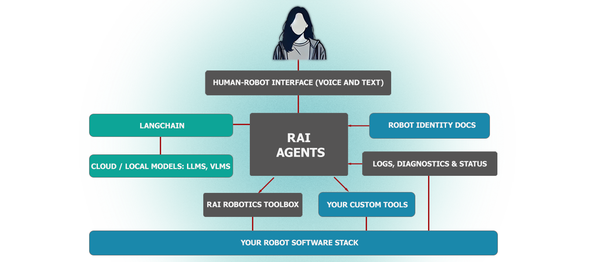

# RAI

RAI is a flexible AI agent framework to develop and deploy Embodied AI features for your robots.

---

---

---

## RAI framework

-   [x] rai core: Core functionality for multi-agent system, human-robot interaction and
        multi-modalities.
-   [x] rai whoami: Tool to extract and synthesize robot embodiment information from a structured
        directory of documentation, images, and URDFs.
-   [x] rai_asr: Speech-to-text models and tools.
-   [x] rai_tts: Text-to-speech models and tools.
-   [x] rai_sim: Package for connecting RAI to simulation environments.
-   [x] rai_bench: Benchmarking suite for RAI. Test agents, models, tools, simulators, etc.
-   [x] rai_perception: Object detection tools based on open-set models and machine learning techniques.
-   [x] rai_nomad: Integration with NoMaD for navigation.
-   [ ] rai_finetune: Finetune LLMs on your embodied data.

